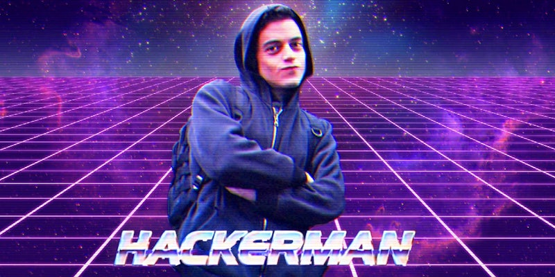
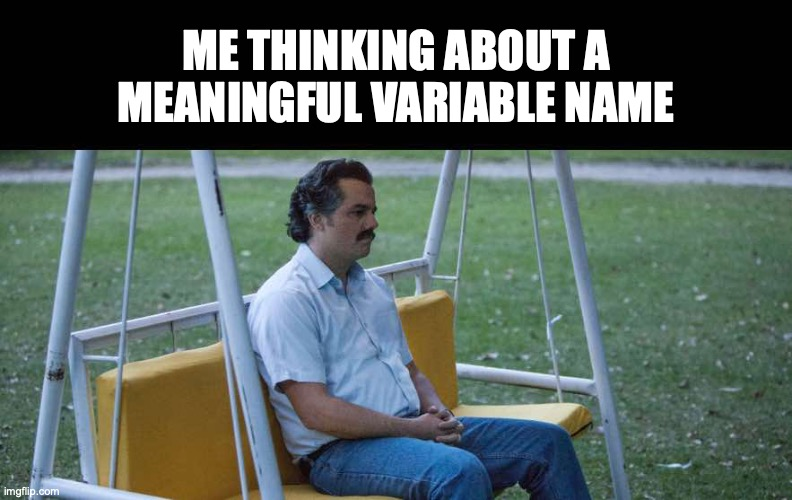
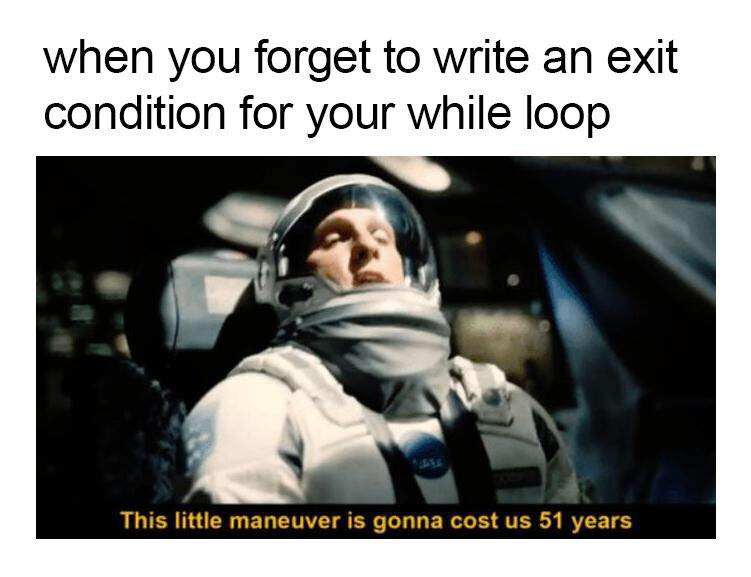
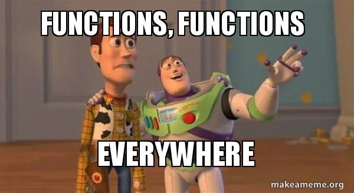

.. Author: Akshay Mestry <xa@mes3.dev>
.. Created on: Saturday, March 08 2025
.. Last updated on: Sunday, March 09 2025

:og:title: Introduction to Programming
:og:description: A comprehensive guide to my "ideal" courses to equip students
    for the ever-evolving tech industry.
:og:type: article

.. _course-codex-intro-to-programming:

===============================================================================
Introduction to Programming
===============================================================================

.. author::
    :name: Akshay Mestry
    :email: xa@mes3.dev
    :about: DePaul University
    :avatar: https://avatars.githubusercontent.com/u/90549089?v=4
    :github: https://github.com/xames3
    :linkedin: https://linkedin.com/in/xames3
    :timestamp: Mar 08, 2025

- **Duration.** 10 weeks
- **Language.** Language-agnostic (`Python`_ as an experimenting language)

.. note::

    The course code and title may vary from uni to uni. This is an entry-level
    foundational course offered in most if not all schools to students in
    their freshman year. This course is a prerequisite for almost all the
    software development, machine learning and computer science courses.

-------------------------------------------------------------------------------
Overview
-------------------------------------------------------------------------------

Programming is more than writing lines of code. It's about learning how to
think like a problem-solver and breaking down complex ideas into smaller,
manageable pieces. In this course, we won't just learn and memorise syntaxes
or chase after clever one-liners or cheeky hacks; we'll focus on building a
solid foundation, one that will empower you to pick up any programming
language in the future. Although Python will be our guiding tool due to its
simplicity and rich library support, the real goal here is to make you
comfortable with the concepts of programming |dash| the logic, structures, and
the core paradigms |dash| so that languages like `C++`_, `Java`_, or
`JavaScript`_ feel less like mountains to climb and more like familiar
landspaces.

By the end of this 10-week journey, you'll be able to solve small, everyday
problems with code by automating repetitive tasks, building simple programs, or
even kickstarting a personal project you've always dreamed about. More
importantly, you'll have the mindset and confidence to build something from
scratch, break it, fix it, and make it better!

-------------------------------------------------------------------------------
Objectives
-------------------------------------------------------------------------------

By the end of this course, you will:

- develop a programmer's mindset, cultivate a logical problem-solving way of
  thinking that extends beyond writing code.
- think beyond the syntax and learn not just how to write code, but why
  certain approaches work better than others.
- master fundamental concepts |dash| variables, loops, conditionals,
  functions, and objects |dash| core constructs you'll find in nearly every
  programming language.
- write clear, structured, and maintainable code by learning how to organise
  your thoughts into clean, efficient, and reusable code, a skill that's super important for both personal projects and team collaborations.
- understand language-agnostic principles by recognising the patterns that
  underline all programming languages, so you can easily transition to other
  languages like C++, `Rust`_, or JavaScript down the road.
- solve problems by applying programming to small, personal tasks like
  automating a daily chore, parsing a text file, or building a basic to-do app.
- prepare yourself for future courses and industry workloads by building a
  strong foundation that will make advanced topics like `algorithms`_, data
  structures, AI, and cloud computing far less intimidating.
- learn to Google your way through any debugging session!!!

This course isn't just about **"getting the right answers."** It's about
learning how to ask or rather Google the right questions.

-------------------------------------------------------------------------------
Structure
-------------------------------------------------------------------------------

Below is the week-by-week breakdown of how we will proceed through our
curriculum:

.. _developing-a-programming-mindset:

Developing a Programming Mindset
===============================================================================

Since it's the first week, we won't dive headfirst into coding but rather
cheekily rewire ourselves to think like a programmer. Before writing fancy
algorithms, we need to learn how to break problems into smaller, logical steps.
This week is all about developing a programming mentality.

.. rubric:: What we'll cover
    :heading-level: 3

#. **What is programming?**

   - Understanding programming as a problem-solving tool.
   - How computers **"think"**? Basics of how code gets executed
     (`interpreted vs. compiled languages`_).
   - Why programming is more about logic than language?

#. **Thinking like a machine**

   - Decomposing problems: breaking down complex tasks into smaller steps.
   - What an algorithm (step-by-step solution) means?

#. **Your first program**

   - Writing a `hello world`_ program in multiple languages (primarily Python).
   - Understanding similarities and differences in semantics and syntaxes
     across multiple languages.
   - Interpreting error messages and searching for solutions on the
     internet.

#. **Building blocks of code**

   - Introduction to fundamental concepts of programming like variables,
     data types, etc. and their similarities with Maths.

.. rubric:: Interactive Hands-On Lab
    :heading-level: 3

- Compare and dissect various programming blocks for the same code across
  multiple programming languages.

.. rubric:: Reflection and Homework
    :heading-level: 3

#. **Reflect.** Whatever you learned today about programming in any way,
   shape, or form.
#. **Reflect.** What you think about **"step-by-step thinking"** and compare
   how you would normally solve a problem?
#. **Homework.** Find a simple program that solved a problem |dash| bring at
   least one example to share next week (it can be anything from a simple
   algorithm or someone's personal project you found online).

.. _data-types-the-art-of-naming:

Data Types & The Art of Naming
===============================================================================

This week, we'll dive deeper into one of the most essential concepts in
programming |dash| variables |dash| and uncover the art and science behind how
we store and manipulate data.

But here's the twist: this isn't just about learning what a variable is |dash|
it's about truly understanding how data moves and lives within your programs.
A variable isn't just a "box" or "placeholder" for holding information |dash|
it's a label for something deeper. We'll explore how variables work behind the
scenes, how memory allocation plays a role, and why naming things in
programming is both an art form and a crucial skill for writing clean,
meaningful code.

.. rubric:: What we'll cover
    :heading-level: 3

#. **What exactly is a Variable?**

   - Variables as labels for data stored in memory.
   - Mutable vs. Immutable types.
   - Dynamic typing in Python vs. Static typing in other languages.

#. **Demystifying data types**

   - Primitive data types: Integers, Floating-point numbers, Strings, and
     Booleans.
   - Composite data types: Lists, Tuples, and Dictionaries.
   - Data Type conversions (type casting).

#. **The art of naming variables**

   - Why meaningful names matter |dash| code is read more than it's written.
   - Best practices and naming conventions (Python and other languages).
   - Code clarity |dash| why readability always wins.

#. **Working with variables**

   - Assigning and reassigning values to a variable.

.. admonition:: Personal note

    I remember the first time I wrote code, my variable names were all over
    the place |dash| x, y, temp, i and j, because someone online told me
    that's what "cool programmers" used. But as I started working on larger
    projects and collaborating with others, I realised that the clarity of my
    variable names wasn't just for me |dash| it was for future me and anyone
    else reading my code.

    Think of it like leaving breadcrumbs for yourself. When you come back to
    your code weeks or months later, well-named variables are like clear road
    signs |dash| they help you navigate through your own logic without getting
    lost.

.. rubric:: Interactive Hands-On Lab
    :heading-level: 3

- Design a simple **"Budget Tracker"** program where users input their daily
  expenses (items and costs), and the program then calculates the total money
  spent. The outcome of this lab is to learn how to use meaningful variable
  names and start thinking about how to store data for future use.

.. rubric:: Reflection and Homework
    :heading-level: 3

#. **Reflect.** What was the most challenging part about naming your
   variables?
#. **Homework.** Find a small open-source project (possibly Python for
   simplicity) on `GitHub`_. Look at how the developer has named their
   variables and the data structures (data types). Bring at least one good and
   one bad example to discuss in class next week.
#. **Homework.** Refactor the code from W1 by giving all the variables
   clearer, more descriptive and appropriate names according to your way.

.. admonition:: Extra credit!

    Find at least two unique and funny memes or developer stories about the
    importance of meaningful variable names. The memes should be different from
    what we've seen during the class.

.. _mastering-control-flows-loops:

Mastering Control Flows & Loops
===============================================================================

Last week, we explored variables and data types, building a foundation for how
we store and manage data. Now, it's time to breathe life into our programs by
introducing control flow |dash| the secret sauce that allows your code to make
decisions, repeat actions, and react to different situations.

At its core, control flow is what separates a simple scrappy script from a
dynamic, interactive program. Without it, our code would be like a robot
following a straight line, unable to turn corners or change course. But by
mastering conditionals and loops, we can unlock the power to guide your
program's behaviour based on user input, data changes, or any custom logic we
design.

This week, we'll tackle if-statements, for-loops, and while-loops |dash| but
not just by learning syntax. We'll break down the logic behind branching paths
and repeated actions, encouraging you to think about how and why decisions are
made in your code.

By the end of this week, you won't just know how to write loops |dash| you'll
know how to write clean, purposeful loops, avoiding infinite traps and crafting
meaningful conditional logic that mirrors real-world thought processes.

.. rubric:: What we'll cover
    :heading-level: 3

#. **Introduction to control flow**

   - What is control flow, and why is it fundamental?
   - Visualising a flowchart in programming |dash| how programs **"think"**.

#. **Conditional statements**

   - Basic if statements (making simple decisions).
   - Adding complexity with elif and else.
   - Nested conditionals |dash| how far is too far?
   - Switch cases and Match statements.
   - Truthy and Falsy values in Python |dash| the hidden meaning behind
     conditions.

#. **Loops and iteration**

   - For-loops.
   - Iterating over ranges (range and enumerate), strings, and lists.
   - While-loops and its anatomy.
   - Writing clear loop conditions; avoid infinite loops!
   - Breaking out of the loops and unwanted skipping iteration.
   - Added bonus: Do-While loops and GoTo.

#. **Loop control statements**

   - Comparing control flows across multiple languages.

.. rubric:: Interactive Hands-On Lab
    :heading-level: 3

- Design a "guessing number" game where the program randomly selects a number
  between a defined range, and the player must guess the number. The program
  should provide hints like "too-high" or "too-low" after each guess. Implement
  a limit on the number of guesses allowed.

.. rubric:: Reflection and Homework
    :heading-level: 3

#. **Reflect.** What was the trickiest part of designing loops this week? Did
   you accidentally write an infinite loop at any point?
#. **Homework.** Find a small open-source project (possibly Python for
   simplicity) on GitHub. Look at how the developer has used control flow in
   their logic. Is there anything that you could do or propose to make it
   better? Bring at least one good and one bad example to discuss in class next
   week.
#. **Homework.** Enhance your "Budget Tracker" from W2 by adding conditional
   checks:

   - Alert the user if their daily spend exceeds a certain threshold.
   - Introduce a loop so that the user can keep adding expenses without
     restarting the program.

.. _dont-repeat-yourself-with-functions:

Don't Repeat Yourself with Functions
===============================================================================

By now, we've laid some serious groundwork. We've explored how data is stored
(Week 2) and how programs make decisions and repeat tasks (Week 3). But what
happens when our code starts to get... messy? This is where functions come to
the rescue. Functions are the ultimate way to organise, reuse, and structure
our code.

Functions are more than just **"reusable chunks of code."** They're a way to
name a process. They let us take a concept, like calculating tax on a bill or
validating a password, and give it a clear, memorable name in our program.
Instead of cluttering our code with repeated logic, we craft a neat, purposeful
function |dash| and then use it whenever we need.

But this week isn't just about learning how to write a ``def my_function():``.
It's about understanding the **"why"**. Why functions are essential for clean
code, why they make our programs more flexible, and why learning to write
small, focused, and meaningful functions will set us apart as a programmer.

By the end of this week, we'll not only be able to write basic functions but
also grasp parameters, return values, and scope |dash| the hidden rules that
control what variables live where in your program.

.. rubric:: What we'll cover
    :heading-level: 3

#. **Introduction to functions**

   - What is function, and why do we need them?
   - Real-life analogies.
   - The difference between built-in and user-defined functions.

#. **Defining and calling functions**

   - Basic function syntax in Python and other languages.
   - Defining a function.
   - Calling functions to execute our code.

#. **Function parameters and arguments**

   - Positional arguments, the standard way of passing information.
   - Keyword arguments, when the order doesn't matter.
   - Default arguments.
   - Subtle difference between parameters (placeholders) and arguments (actual
     values).

#. **Return values**

   - The return statement, getting data back from the function.
   - Functions without a return value.
   - Why ``None`` is still a thing?
   - Returning multiple values.

#. **Variable scope**

   - Local vs. Global variables.
   - Why global variables are often a bad idea but necessary in some cases?

.. rubric:: Interactive Hands-On Lab
    :heading-level: 3

- Design a "tip calculator" function which takes a bill amount and tip
  percentage, then returns the total amount to be paid. Next, extend the
  function by adding an optional arguments for splitting the bill, so you can
  calculate what each person pays if you're dining out with friends. Finally,
  extend the function to handle different currencies (passed as a parameter).
- Write a function that takes a list of numbers and returns the largest,
  smallest, and average values. Run the same experiment using the built-in
  functions.

.. rubric:: Reflection and Homework
    :heading-level: 3

#. **Reflect.** Think of a real-world process you personal repeat quite often.
   For instance, something simple as making a cuppa tea, packing bag for
   school, etc. Could you break it into "functions" |dash| small, reusable
   steps?
#. **Homework.** Enhance your "Budget Tracker" from W3 by adding functions:

   - A ``calculate_total()`` function that sums all the expenses.
   - A ``display_summary()`` function that formats and prints a nice report of
     daily or weekly spendings.

.. _Python: https://www.python.org
.. _C++: https://cplusplus.com/doc/tutorial/
.. _Java: https://www.java.com/en/download/help/whatis_java.html
.. _Javascript: https://developer.mozilla.org/en-US/docs/Web/JavaScript
.. _Rust: https://www.rust-lang.org
.. _algorithms: https://www.geeksforgeeks.org/fundamentals-of-algorithms/
.. _interpreted vs. compiled languages: https://stackoverflow.com/a/69371092
.. _hello world: https://en.wikipedia.org/wiki/%22Hello,_World!%22_program
.. _GitHub: https://www.github.com
