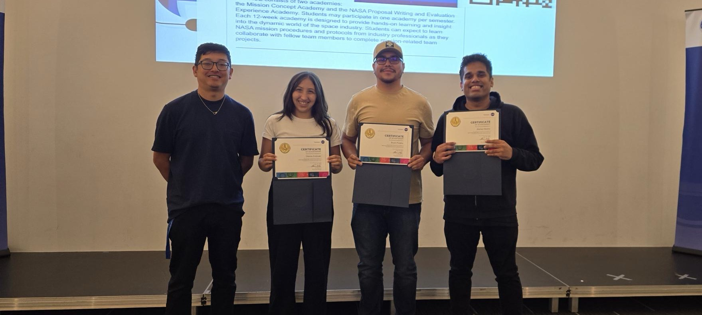

.. Author: Akshay Mestry <xa@mes3.dev>
.. Created on: Saturday, 22 February 2025
.. Last updated on: Thursday, 7 August 2025

:orphan:
:og:title: Studying, Mentorship, And Resourceful Teaching
:og:description: Harnessing Studying, Mentorship, And Resourceful Teaching to
    drive innovation!
:og:type: website

.. _home-page:

===============================================================================
My Studying, Mentorship, And Resourceful Teaching Journey
===============================================================================

.. author::
    :name: Akshay Mestry
    :email: xa@mes3.dev
    :about: National Louis University
    :avatar: https://avatars.githubusercontent.com/u/90549089?v=4
    :github: https://github.com/xames3
    :linkedin: https://linkedin.com/in/xames3
    :timestamp: 7 August, 2025

Hello hello!

I am **Akshay** (/uh-k-ʃ-æ/), an Adjunct Professor at National Louis
University, AI Engineer, and open-source contributor dedicated to the
intersection of technology and learning. This corner of the internet serves
both as a digital portfolio, showcasing my work, and a space where I share my
learning and teaching experiences in the fields of Artificial Intelligence,
Software Development, Scientific Computing, and Open Science.

Whilst most of my work revolves around building tools that push the boundaries
of technology and keeping accessibility in mind, I have a special interest in
reinforcement learning, numerical computing, and natural language processing,
which I have explored through my personal projects. I am also committed to
contributing to the `NASA Open Science`_ mission, promoting transparent,
reproducible, and inclusive research.

    Me at NASA Open Science 2024 at National Louis University, Chicago with
    Dr. Ian Moncrief (left), Gianna Dubinski (centre), and Brian Palafox
    (right)

Alongside Open Science, I practise open source. For me, it is more than a
philosophy. It is my personal reminder to make my learnings, experiences, and
knowledge free and accessible, breaking down cultural and digital barriers and
inviting collaboration across disciplines and borders.

.. _personal-favourites:

-------------------------------------------------------------------------------
Personal favourites
-------------------------------------------------------------------------------

Over the years, I have worked on a diverse range of personal projects, from
building AI systems to crafting efficient numerical computing libraries. My
projects reflect both technical depth and a passion for education. Some
highlights include:

- **xsNumPy & SlowTorch.** Lightweight educational libraries inspired by
  `NumPy`_ and `PyTorch`_, built to simplify complex concepts for learners and
  researchers.

  Read the journeys of building :doc:`xsNumPy <projects/xsnumpy>` and
  :doc:`SlowTorch <projects/slowtorch>` |chvrn|

- **Reinforcement Learning.** An AI-driven Snake game including the environment
  built in `Pygame`_, featuring a modular agent and optimised reinforcement
  learning strategies.

Beyond these, I have had the opportunity to speak at tech meetups and
conferences, sharing insights on projects, AI, Open Science, and the inner
workings of numerical computing frameworks. These experiences have strengthened
my resolve to not only build innovative tools but also inspire and empower
others through education.

.. _passion-for-teaching:

-------------------------------------------------------------------------------
Passion for teaching
-------------------------------------------------------------------------------

Teaching is not just something I do, it is a fundamental part of how I approach
technology. I wholeheartedly believe that true mastery comes from sharing
knowledge. Whether it is breaking down complex AI algorithms or explaining the
nuances of machine learning, I find joy in making technical concepts accessible
and easy to grasp. Early in my Software Engineering career, I heard a quote...

.. epigraph::

    If you want to master something, teach it.

    -- Richard Feynman

And I absolutely fell in love with this idea. Soon I realised you really
cannot call yourself an SME (`Subject-matter expert`_) until you can teach it
to those who likely know nothing about it (or very little), and are willing to
entertain questions from people learning at that initial frame of reference.
Thus began my journey into teaching. Although my approach or my teaching
philosophy to put it simply has evolved over the past few years, adapting to
the needs of my environment, students, and time. It is rooted in three core
principles:

- **Learning by building.** Encouraging hands-on projects as a way to solidify
  or reinforce abstract concepts and theoretical knowledge.
- **Clarity through simplicity.** Distilling complex ideas into simple,
  digestible explanations without compromising depth.
- **Inclusive knowledge.** Ensuring educational resources are open,
  transparent, and available to all, aligning with my open source vision.

.. _why-this-website:

-------------------------------------------------------------------------------
Why this website?
-------------------------------------------------------------------------------

This website is more than just a portfolio, it is a dynamic space where I blend
technology and education. Through this website, I hope to build a community
where technology meets education, and where we learn, teach, and grow together.
I am hoping to achieve the following:

- **Showcasing projects.** Highlighting my work in AI, scientific computing,
  and software development.
- **Teaching platform.** Offering blog posts, tutorials, and deep dives into
  AI, RAG systems, reinforcement learning, and more.
- **Collaboration.** For students, researchers, developers, and learners who
  share a curiosity for pushing the frontiers of technology.

Ultimately, my goal is to use my personal corner or this platform to bridge
the gap between collaboration and education, building tools, sharing ideas,
and helping others grow alongside me.

.. _get-in-touch:

-------------------------------------------------------------------------------
Get in touch
-------------------------------------------------------------------------------

I am always open to conversations about AI, teaching, open source, or just a
casual chat about life, I would love to hear from you. It does not need to be
just about the tech either; I am a huge film buff! If you are also passionate
about films, feel free to reach out or send a recommendation or two.

You can reach me via `Email <mailto:xa@mes3.dev>`_,
`LinkedIn <https://www.linkedin.com/in/xames3>`_, or
`GitHub <https://github.com/xames3>`_.

.. _NASA Open Science: https://science.nasa.gov/open-science/
.. _NumPy: https://numpy.org/
.. _PyTorch: https://pytorch.org/
.. _Pygame: https://pygame.org/
.. _Subject-matter expert: https://en.wikipedia.org/wiki/Subject-matter_expert

.. toctree::
    :caption: Development
    :maxdepth: 1
    :hidden:

    projects/xsnumpy
    projects/slowtorch

.. toctree::
    :caption: Teaching
    :hidden:

    learning-out-loud/index
    course-codex/index

.. toctree::
    :caption: Miscellany
    :hidden:

    miscellany/guiding-stars
