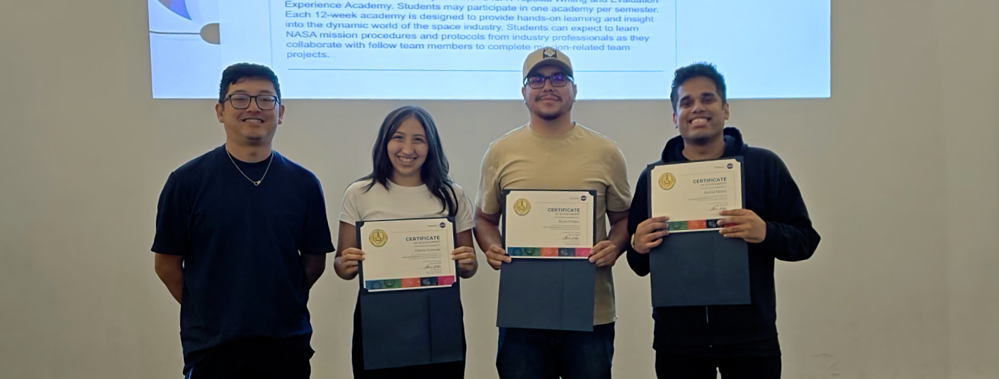

.. Author: Akshay Mestry <xa@mes3.dev>
.. Created on: Saturday, 22 February 2025
.. Last updated on: Wednesday, 10 September 2025

:orphan:
:og:title: Studying, Mentorship, And Resourceful Teaching
:og:description: Harnessing Studying, Mentorship, And Resourceful Teaching to
    drive innovation!
:og:type: website

.. _home-page:

===============================================================================
Studying, Mentorship, And Resourceful Teaching
===============================================================================

.. author::
    :name: Akshay Mestry
    :email: xa@mes3.dev
    :about: Adjunct, National Louis University
    :avatar: https://avatars.githubusercontent.com/u/90549089?v=4
    :github: https://github.com/xames3
    :linkedin: https://linkedin.com/in/xames3
    :timestamp: 8 Aug, 2025

.. rst-class:: lead

    A journey of studying, mentorship, and resourceful teaching

Hello hello!

I'm **Akshay** (/uh-k-ʃ-æ/), an Adjunct Professor at National Louis
University, AI Engineer, and open-source contributor dedicated to the
intersection of technology and learning. This corner of the internet serves
both as a digital portfolio, showcasing my work, and a space where I share my
learning and teaching experiences in the fields of Artificial Intelligence,
Software Development, Scientific Computing, and Open Science.

    Me at NASA Open Science 2024 at National Louis University, Chicago with
    Dr. Ian Moncrief (left), Gianna Dubinski (centre), and Brian Palafox
    (right)

I've a special interest in natural language processing, reinforcement
learning, and numerical computing, which I've explored through my personal
projects. I'm also committed to contributing to the `NASA Open Science`_
mission, promoting transparent, reproducible, and inclusive research.

.. _open-source:

-------------------------------------------------------------------------------
Open Source
-------------------------------------------------------------------------------

Alongside Open Science, I practise open source. For me, it is more than a
philosophy. It is my personal reminder to make my learnings, experiences, and
knowledge free and accessible, breaking down cultural and digital barriers and
inviting collaboration across disciplines and borders.

I've worked on a diverse range of projects, from building performant machine
learning models to crafting efficient numerical computing libraries. My
projects reflect both technical depth and a passion for education. Some
highlights include:

- **xsNumPy & SlowTorch.** Lightweight educational libraries inspired by
  `NumPy`_ and `PyTorch`_, built to simplify complex concepts for learners and
  researchers.

  Read my stories of building :doc:`xsNumPy <projects/xsnumpy>` and
  :doc:`SlowTorch <projects/slowtorch>` |>|

- **Reinforcement Learning.** `Snake game <https://gist.github.com/xames3/
  563c99598c2aa1dd84e3c9494b648063>`_ including the environment built in
  `Pygame`_, featuring a modular agent and an optimised reinforcement learning
  strategy.

Beyond these, I've had the opportunity to speak at tech meetups and
conferences, sharing insights on my projects, AI, Open Science, and the inner
workings of numerical computing frameworks.

.. _teaching-philosophy:

-------------------------------------------------------------------------------
Teaching philosophy
-------------------------------------------------------------------------------

I wholeheartedly believe that true mastery comes from sharing knowledge.
Whether it is breaking down complex machine learning algorithms or explaining
the nuances of AI, I find joy in making technical concepts relatable and easy
to grasp. Early in my Software Engineering career, I heard a quote...

.. epigraph::

    If you want to master something, teach it.

    -- Richard Feynman

And I absolutely fell in love with this idea. Soon I realised you really can't
call yourself an SME (`Subject-matter expert`_) until you can teach it to
those who likely know nothing about it (or very little), and are willing to
entertain questions from people learning at that initial frame of reference.
Thus began my journey into teaching. Although my approach of teaching has
evolved over the past few years, adapting to the needs of my environment,
students, and time.

.. _purpose-and-vision:

-------------------------------------------------------------------------------
Purpose and vision
-------------------------------------------------------------------------------

This website is more than just a portfolio, it is a space where I blend
technology and education. Through this website, I hope to build a community
where technology meets education, and where I can learn, teach, and grow
alongside you.

Ultimately, my goal is to use this corner on the internet to bridge the gap
between collaboration and education, building tools, and sharing ideas.

.. _lets-connect:

-------------------------------------------------------------------------------
Let's connect
-------------------------------------------------------------------------------

I'm always open to conversations about AI, teaching, open source, or just a
casual chat about life. I'd love to hear from you. It doesn't need to be just
about the tech either; I'm a huge film nerd and I enjoy memes!! If you are
also passionate about films or want to share something funny, feel free to
reach out or send a recommendation or two.

I don't use, nor am I on, any social media, but I'm reachable via
`email <mailto:xa@mes3.dev>`_ or via
`LinkedIn <https://www.linkedin.com/in/xames3>`_.

.. _NASA Open Science: https://science.nasa.gov/open-science/
.. _NumPy: https://numpy.org/
.. _PyTorch: https://pytorch.org/
.. _Pygame: https://pygame.org/
.. _Subject-matter expert: https://en.wikipedia.org/wiki/Subject-matter_expert

.. toctree::
    :caption: Explained
    :hidden:
    :titlesonly:

    explained/docker/index

.. toctree::
    :caption: Development
    :hidden:

    projects/xsnumpy
    projects/slowtorch

.. toctree::
    :caption: Miscellany
    :hidden:
    :maxdepth: 2

    miscellany/guiding-stars
    miscellany/youtube-videos
