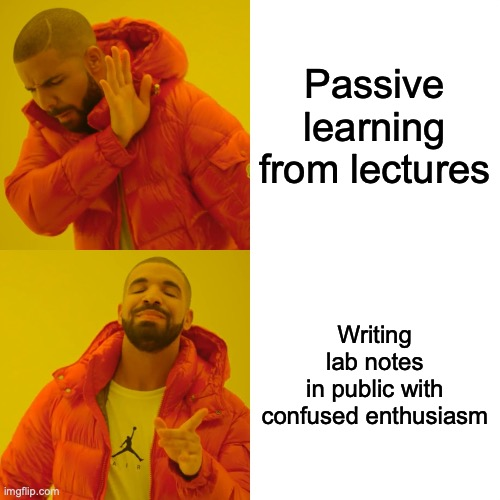

.. Author: Akshay Mestry <xa@mes3.dev>
.. Created on: Friday, 25 April 2025
.. Last updated on: Friday, 8 August 2025

:og:title: Learning Out Loud
:og:description: When one teaches, two learn...
:og:type: article

.. _learning-out-loud-index:

===============================================================================
Learning Out Loud
===============================================================================

.. author::
    :name: Akshay Mestry
    :email: xa@mes3.dev
    :about: National Louis University
    :avatar: https://avatars.githubusercontent.com/u/90549089?v=4
    :github: https://github.com/xames3
    :linkedin: https://linkedin.com/in/xames3
    :timestamp: Apr 25, 2025

This article isn't just a space to stash my AI and machine learning notes,
it's a living reflection of how I've come to understand these ideas, and how I
continue to wrestle with them in public. Ever since I first started getting
into machine learning in 2018, I've been fascinated not just by what these
"models" can do, but by how we come to understand them. I've made my fair
share of mistakes, read the same paper five times just to make sense of one
paragraph, and written buggy models that taught me more than any lecture
could. But somewhere in all that trial and error, I also found clarity |dash|
the kind that sticks when you try to teach something to someone else.

This section, Learning Out Loud (LOL), is my humble attempt to do just that.
It's not a course. It's not a tutorial series in the traditional sense. It's
a place where I unpack, explain, and reflect on concepts in machine learning
and AI. If :doc:`../course-codex/index` is my attempt to design the courses I
wish I'd been taught, then this is where I actually teach them. Out loud. As I
think. As I learn. Slowly, thoughtfully, and with the hope that it helps
someone else connect the dots. If you're reading this (thank you by the way),
I'm not here to dazzle you with complexity or gatekeep behind jargon. My aim
is to build understanding from the ground up, to offer practical explanations
grounded in real engineering work, and to make space for thinking out loud,
especially when things are murky.

Some articles will feel like quiet lectures. Others will read more like lab
notes or rants from a whiteboard session. All of them are teaching moments for
you, and for me. These are not polished lectures or formal research. They're
more like annotated ideas, teachable moments, and deep dives written for
students, engineers, and the endlessly curious.

So whether you're just starting out, teaching others, or knee-deep in your own
experiments, I hope you find something here that makes you pause and say, "Ah,
now that makes sense." And if not... that's alright too. Learning out loud
means we get to revisit things as many times as we need.

.. toctree::
    :hidden:

    ml-explained/index
