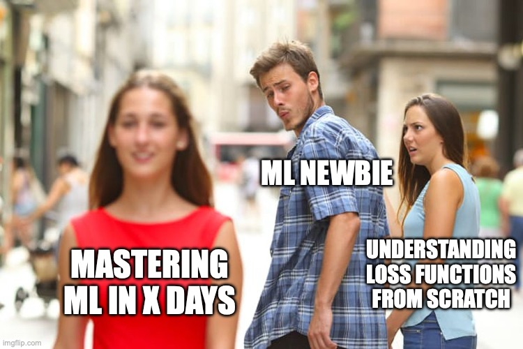

.. Author: Akshay Mestry <xa@mes3.dev>
.. Created on: Friday, April 25 2025
.. Last updated on: Sunday, May 04 2025

:og:title: ML Explained
:og:description: A narrative series that walks through the foundations of
    Machine Learning from first principles.
:og:type: article

.. _ml-explained-index:

===============================================================================
ML Explained
===============================================================================

.. author::
    :name: Akshay Mestry
    :email: xa@mes3.dev
    :about: National Louis University
    :avatar: https://avatars.githubusercontent.com/u/90549089?v=4
    :github: https://github.com/xames3
    :linkedin: https://linkedin.com/in/xames3
    :timestamp: May 04, 2025

This corner of the internet is the place where I attempt to teach Machine
Learning the way I wish I'd first encountered it... slowly, clearly, and with
context that sticks. If you've ever googled, "machine learning" and landed on a
sea of buzzwords, equations, or flowcharts that left you more confused than
enlightened; welcome! You're not alone. I've been there too, and it's part of
why I'm writing this series.

The people that know me well, know that I do not have a good attention span. So
I'll keep things short. This explainer series is not going to be a tutorial or
a crash course. It's more like a conversation. A walk-through of the key
ideas, the questions worth asking, and the principles you actually need to
understand before you care about the accuracy scores or the latest Transformer
papers out there. Like I said earlier, I'd like to keep things short but, not
incomplete. Each article will be hopefully short, focused, and designed to
build up your intuition over time.

This is **not** about "Mastering ML in X days". It's about learning out loud
and learning well.

.. toctree::
    :hidden:

    ml101
