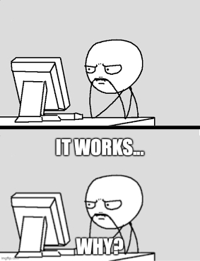

.. Author: Akshay Mestry <xa@mes3.dev>
.. Created on: Friday, April 25 2025
.. Last updated on: Sunday, May 04 2025

:og:title: ML101
:og:description: Understanding learning as function approximation, not magic.
:og:type: article

.. _ml101:

===============================================================================
ML101
===============================================================================

.. author::
    :name: Akshay Mestry
    :email: xa@mes3.dev
    :about: National Louis University
    :avatar: https://avatars.githubusercontent.com/u/90549089?v=4
    :github: https://github.com/xames3
    :linkedin: https://linkedin.com/in/xames3
    :timestamp: May 03, 2025

.. rst-class:: lead

   This isn't a crash course. There's no "ultimate guide" here, no promise to
   make you an expert over a weekend

To be fair, this doesn't really need explaining. If you're here, chances are
you already have some sense of what Machine Learning is, or at least you feel
you ought to. I'm not about to hand you some ground-breaking new definition.
What I do hope to offer is clarity, to dispel some of the haze, the
half-truths, and the misguided metaphors that surround Machine Learning. Not
just in the press or on LinkedIn slides, but also in the way it's taught,
explained, and even practised by fellow professionals. You see, Machine
Learning is often treated like a black box that "just works", a clever
contraption that learns because it's somehow intelligent. You collect some
data, feed it into a model, twiddle a few parameters, and voilà, it learns.
Except it doesn't, not in the way you might think. The word "learning" here is
doing rather a lot of heavy lifting.

The issue isn't that people are unaware of Machine Learning, it's that we
seldom pause to understand it deeply. The explanations on offer, blog posts,
conference talks, YouTube tutorials, often skip the foundations. We learn
**how** long before we ever touch **why**. And without the **why**, Machine
Learning becomes little more than glorified pattern recognition wrapped in
prestige.

.. _a-new-kind-of-programming:

-------------------------------------------------------------------------------
A New Kind of Programming?
-------------------------------------------------------------------------------

Machine Learning, at its essence, is a different philosophy of programming.
Before I get ahead of myself, let's try to understand what programming is. To
keep things simple, programming is an "art" of writing programs... duh! I mean
there's more to that like development, testing, integration, etc. But what it
boils down to is writing a code or program which is nothing but a fancy way of
writing instructions which the computer (machine) will follow. So, basically
a program is a set of instructions or when you say I'm a programmer, I write
instructions for the computer (machine) to follow along.  If you've taken any
Machine Learning class before, you might've come across this definition...

.. epigraph::

    Machine Learning is the field of study that gives computers the ability to
    learn without being explicitly programmed

    -- Arthur Samuel, 1959

In the classical approach, we often write explicit instructions, handcrafted
rules, conditional logic, or, to keep it precise, programs. The machine doesn't
think. It simply obeys or follows those rules or instructions.

Machine Learning flips this paradigm.

Instead of coding or programming the logic ourselves, we supply the machine
(computer) with examples. And I mean a lot of them. By the way, these examples
are inputs and the desired outputs. We then ask the algorithm (another
program) to infer the rules or instructions that connect the two. That's the
entire conceit. We don't program the rules. We let the machine learn them. You
don't tell the system what to do; you show it what has been done and let it
infer the rest.

And just because you let the "system" or "machine" learn, it
doesn't mean you don't do anything. Learning is a process. It's not unlike
teaching a child to ride a bicycle. You don't explain Newtonian mechanics or
angular momentum. You run alongside them, steady the seat, and let them wobble.
The learning comes along through doing. Like I said, its a process. The rules
emerge from experience.
