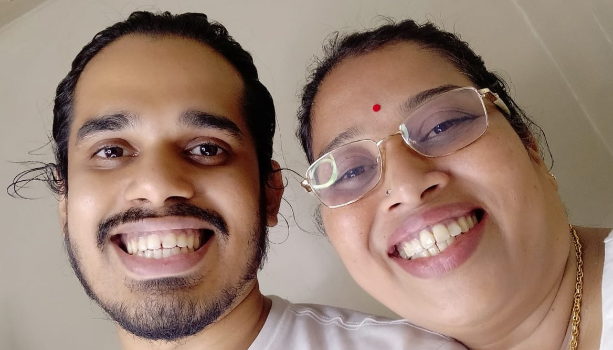
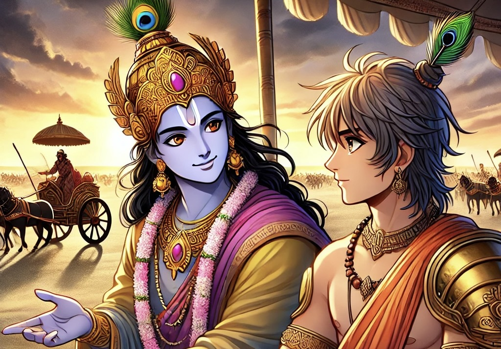

.. Author: Akshay Mestry <xa@mes3.dev>
.. Created on: Monday, February 24, 2025
.. Last updated on: Wednesday, February 26 2025

:og:title: Guiding Stars
:og:description: Expressing heartfelt gratitude to the heros who shaped my
    path in AI, Learning, and Beyond
:og:type: article

.. _guiding-stars:

===============================================================================
Guiding Stars
===============================================================================

.. author::
    :name: Akshay Mestry
    :email: xa@mes3.dev
    :about: DePaul University
    :avatar: https://avatars.githubusercontent.com/u/90549089?v=4
    :github: https://github.com/xames3
    :linkedin: https://linkedin.com/in/xames3
    :timestamp: Feb 25, 2025

.. rst-class:: lead

   Heartfelt gratitude to the people who shaped my path in AI, Learning, and
   Beyond

Blimey! While writing this article, I paused for a moment to reflect on my
personal achievements and learnings. As I was thinking about most, if not all,
of the significant milestones in my career |dash| from choosing a career path
into the realm of Artificial Intelligence to building this platform |dash|
stands a massive constellation of remarkable individuals who've shaped the
person I'm today. To those prominent figures in my life, this article is more
than an acknowledgment; it is a small tribute to those whose support, wisdom,
and belief in me have fueled my passion for technology, teaching, and open
source.

.. _like-gaia-you-ground-me:

-------------------------------------------------------------------------------
Like Gaia, you ground me
-------------------------------------------------------------------------------

At the very core of this journey is my mother, **Sunita**. Like `Gaia`_, the
Earth goddess who gives life to all, my Mum has been the quintessential
foundation of my existence. Mum, your unwavering support and belief during my
highs and lows has been the cornerstone of my ambition. Although I didn't get
to spend a lot of time with you in my early days, you taught me the value of
persistence, the inevitability of hard choices in life, and the importance of
embracing my past.

    My mum and I, back in September of 2022, right after my admission into
    DePaul University at our family home in Enfield

From the moments of comfort at my lowest to the greatest acts of selflessness
at my peak, you have been there, guiding me through it all, keeping me
grounded. I'm happy and content today with my life for the choices you helped
me make. I still remember when I chose the career path to pursue Artificial
Intelligence |dash| a field vast and complex at that time |dash| your
encouragement was the anchor that kept me grounded and disciplined. All those
late nights, sitting at the kitchen table with stacks of programming books,
preparing for the certifications and interviews, you would bring a refreshing
cup of `Masala chai`_, reminding me not to give up but at the same time
reminding the importance of sleep and rest is something I dearly miss.

Ever since Father passed, your love has been the very foundation upon which I
stand, and I'm so grateful for every sacrifice you've made to see me grow and
succeed. Mum, you are my Earth, my Gaia, and I am forever thankful for the
depth of your love and the strength of your spirit.

.. _charlotte-my-uma:

-------------------------------------------------------------------------------
Charlotte, my Uma
-------------------------------------------------------------------------------

**Charlotte**, though you're no longer with us, your influence is an
indispensible part of who I'm today. Much like `Uma`_'s love for `Shankar`_,
transformed him from a celibate hermit to a householder, your presence in my
life catalyzed a profound change in me. You were the spark, my Uma that
ignited my deeper fascination with technology. I vividly remember you helping
me shed layers of self-doubt and superficiality, guiding me towards a deeper
understanding of who I truly am. It was you who pushed me to question things
and go beyond the surface-level understanding but to understand the
mathematics and logic behind them.

It was because of you, my interest in technology grew with time, and while it
was growing, you reminded me that these technologies aren't just about
algorithms and problem-solving |dash| it is about impact. I remember how you
would listen patiently as I rambled about new technologies or tools, always
asking the right questions that made me think harder and dig deeper. Your
encouragement pushed me to think how technology could transform lives, and
more importantly, how I could share that knowledge with others. It was your
faith in my ability as a teacher that made me realize the joy of sharing
knowledge. You often said, "*Akshay, the best way to learn is to teach.*"
Those words still echo in my heart every time I stand before a classroom or
mentor someone. In every student I mentor, I see you and it reminds me of our
last conversation...

.. epigraph::

    If you loved me like a child, then live your life like a child. Walk this
    rock like a child. Keep moving forward through calm and storm, I'll always
    be with you Akshay, but in a different form.

    -- Charlotte Parks

Just as Uma's love shaped and transformed Shankar, your love shaped and
transformed me, guiding me into my truest form. It was your belief in me as a
teacher that planted the seed for this very platform. Your spirit lives on in
every tutorial I write, every student I mentor, and every piece of knowledge I
share.

.. _sajiths-guidance-krishnas-wisdom:

-------------------------------------------------------------------------------
Sajith's guidance, Krishna's wisdom
-------------------------------------------------------------------------------

Back in 2017, my professional career took off at `Accenture`_. Accenture, the
company, will always hold a special place in my heart. This is where I was
fortunate to work under the mentorship of **Sajith Malayath**. Sajith was the
first person who truly believed in me |dash| not just as a worker, but as
someone capable of achieving great things in AI and Machine Learning. It's
been quite a while since I worked at Accenture, but I remember when I first
started, I was still figuring out my place in the cut-throat corporate world.
I was nervous and frustrated at the same time. But you, Sajith, you saw
something in me that I wasn't sure even existed.

I'll never forget the day you took me for a walk and explained how to look at
the bigger picture, about my life, my career, and relationships. I was indeed
overwhelmed, unsure of myself. But you never gave up on me but pushed me to
grow in ways I hadn't imagined. Although you were my manager, much senior in
the career level, you never treated me any differently. Your approach was
unlike any I had experienced before. I do remember you telling me, "*It's never
about doing things perfectly; it is about learning and evolving along the
way.*"

    Image generated with `Flux-Animex-v2-LoRA
    <https://huggingface.co/spaces/Neaty/anime>`_ model

Those simple words taught me a lesson that stayed with me ever since. You
always encouraged me to dive into the deep end, to question things, to
understand the "why" behind every decision. And when I struggled, as I
inevitably did, you didn't just offer solutions. You guided me like a mentor,
always patient, always present, but never hovering. Sajith, you were more than
a mentor to me |dash| you were my guide, my `Krishna`_. That guidance is what
has carried me forward in my academic and professional pursuits to this day.

.. _Gaia: https://en.wikipedia.org/wiki/Gaia
.. _Masala chai: https://en.wikipedia.org/wiki/Masala_chai
.. _Uma: https://en.wikipedia.org/wiki/Parvati
.. _Shankar: https://en.wikipedia.org/wiki/Shiva
.. _Accenture: https://www.accenture.com/us-en
.. _Krishna: https://en.wikipedia.org/wiki/Krishna
