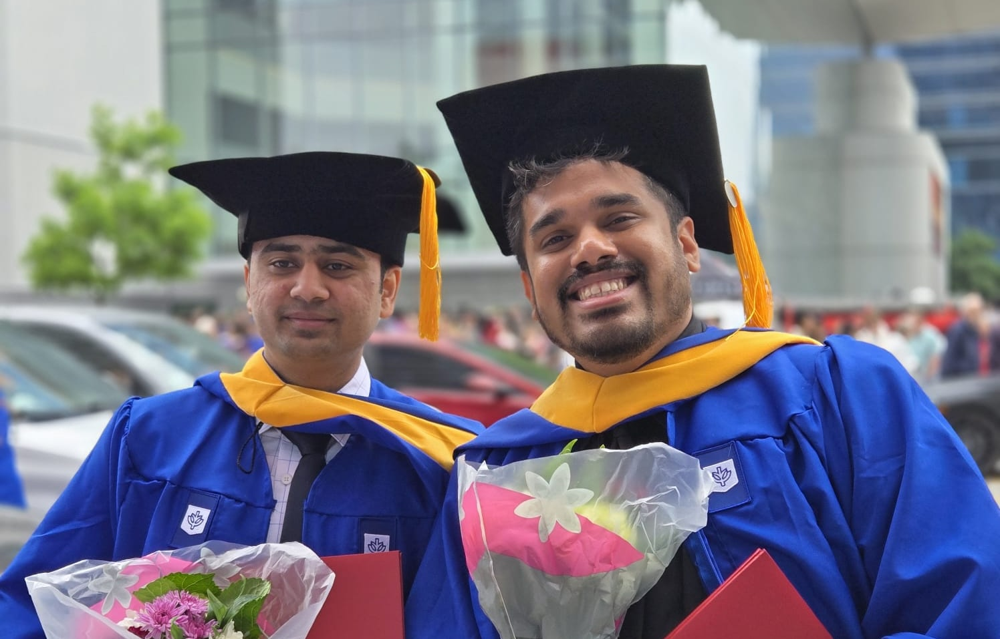
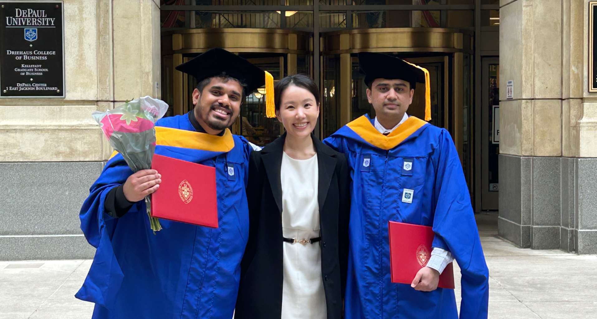

.. Author: Akshay Mestry <xa@mes3.dev>
.. Created on: Monday, 24 February 2025
.. Last updated on: Friday, 8 August 2025

:og:title: Guiding Stars
:og:description: Expressing heartfelt gratitude to the heros who shaped my
    path in AI, Learning, and Beyond
:og:type: article

.. _miscellany-guiding-stars:

===============================================================================
Guiding Stars
===============================================================================

.. author::
    :name: Akshay Mestry
    :email: xa@mes3.dev
    :about: National Louis University
    :avatar: https://avatars.githubusercontent.com/u/90549089?v=4
    :github: https://github.com/xames3
    :linkedin: https://linkedin.com/in/xames3
    :timestamp: Feb 24, 2025

.. rst-class:: lead

   Heartfelt gratitude to the people who shaped my path in AI, Learning, and
   Beyond

There are moments in life when one pauses to look back, not merely at
achievements, but at the constellation of individuals who've shaped the path.
This article is my tribute to those guiding stars whose wisdom, encouragement,
and friendship have been the bedrock of my growth as a teacher, mentor, and a
lifelong learner. Each person mentioned here has left an significant mark, and
it is through their collective influence that I continue to strive, share, and
inspire.

.. admonition:: A note of gratitude

    This reflection isn't exhaustive, nor could it ever be. Some stories are
    shared in minor detail, yet every individual named here has contributed
    equally to my journey. I'm profoundly grateful for your presence, guidance,
    and support.

.. _like-gaia-you-ground-me:

-------------------------------------------------------------------------------
Like Gaia, you ground me
-------------------------------------------------------------------------------

At the very heart of my journey stands my mum, **Sunita**. Like `Gaia`_, the
Earth goddess who nurtures all life, my mum has been the unwavering foundation
upon which I've built my ambitions. Her steadfast support through every high
and low has shaped my character and instilled in me the values of perseverance,
resilience, and acceptance.

.. figure:: ../assets/me-and-mum.jpg
    :alt: Me and Mum celebrating my admission into DePaul University
    :figclass: zoom

    My mum and I, September 2022, celebrating my admission into DePaul
    University at our family home in Enfield

From comforting me in moments of doubt to celebrating my successes, she has
always been present, gently guiding me and keeping me grounded. I recall
countless evenings at the kitchen table, surrounded by programming books,
preparing for certifications and interviews. She would appear with a
restorative cup of `masala chai`_, reminding me to persist, yet also to rest.
These simple acts of care are cherished far beyond words.

Since my father's passing, her love has been the very ground upon which I
stand. Mum, you're my Gaia, and I'm eternally grateful for your strength.

.. _charlotte-my-uma:

-------------------------------------------------------------------------------
Charlotte, my Uma
-------------------------------------------------------------------------------

Charlotte, though you're no longer with us, your influence remains woven into
the very fabric of my life. Much like `Uma`_'s transformative love for
`Shankar`_, your presence sparked a profound change in me. You encouraged me to
question deeply and to pursue understanding beyond the surface.

Your patient listening and insightful questions challenged me to think
critically and to share knowledge generously. Your belief in my ability to
teach planted the seed for this very platform. You often said, "Akshay, the
best way to learn is to teach." These words echo in my heart each time I stand
before a class or mentor someone. In every student I guide, I see your spirit
reminding me of our last chat...

.. epigraph::

    If you loved me like a man, then live your life like a man. Walk this rock
    like a man. Keep moving forward through calm and storm, I'll always be with
    you Akshay, but in a different form.

    -- Charlotte Parks ❤️

Thank you, Charlotte, for being my Uma.

.. _sajith-my-krishna:

-------------------------------------------------------------------------------
Sajith, my Krishna
-------------------------------------------------------------------------------

My professional journey began at `Accenture`_ in 2017, where I had the
privilege of working under **Sajith**'s mentorship. Sajith, you were the first
to recognise potential in me beyond the routine. I vividly remember our walks,
your advice to "zoom out" and see the bigger picture of life and career. You
never offered empty reassurances, but instead provided steady encouragement to
grow and evolve. Your approach was always patient and insightful, guiding me
to question, to seek understanding, and to learn from every experience.

.. epigraph::

    It is never about doing things perfectly, but about learning and evolving
    along the way.

    -- Saj

These words have still stayed with me, shaping my approach to both work and
life. Saj, you've been more than a mentor; you've been my guide, my Krishna.

.. _end-credits:

-------------------------------------------------------------------------------
End credits
-------------------------------------------------------------------------------

Life, much like cinema, is never a solo act. The true magic lies in the
collective effort of those who work behind the scenes. My journey has been
shaped by an extraordinary cast of mentors, friends, and supporters, each
playing a vital role in the story I share on this platform.

Everything you see/read here, whether it be projects, ideas, teachings, etc.
is the sum of invaluable contributions from those who've stood beside me,
guiding and encouraging me to step beyond my comfort zone. This section is my
version of the end credits: a heartfelt tribute to those whose names may not
always be in the spotlight, but whose impact resonates in every lesson I pass
on.

As with any good film, the credits roll long after the story ends. This list
will continue to grow, as I'm certain there are more brilliant minds and kind
souls yet to cross my path.

.. note::

    The following list is in alphabetical order soley for clarity. Every person
    holds equal importance and has had a significant influence on my life.

.. _cast-cameron-riddell:

Cameron Riddell
===============================================================================

`Cameron <https://www.linkedin.com/in/cameron-riddell/>`_, you've been a
true light in my journey through open science and data visualisation. Although
our conversations have been entirely virtual, your mentorship has bridged
states and time zones, offering clarity and encouragement precisely when I
needed it most. I'm sincerely grateful for your guidance during the formative
stages of my exploration into open science.

Your insights into visualisation, particularly your introduction to
`Edward Tufte`_'s work, have honestly reshaped my approach to presenting and
interpreting data. What I admire most is your teaching style, marked by
patience and generosity. You possess a rare ability to make complex concepts
accessible, and your encouragement has helped me grow both as a learner and as
a teacher.

Cheers for being such a "legend", mate!

.. _cast-fatemeh-taghvaei:

Fatemeh Taghvaei
===============================================================================

**Fatemeh**, our paths crossed thanks to Dr. Tovar while I was still a student
at DePaul and you were teaching at National Louis. He encouraged me to shadow
and attend your AI/ML class, and that experience became a turning point in my
academic career. You're more than a fellow professor; you're a mentor, a
friend, and perhaps my greatest well-wisher.

I still remember my first day teaching... nervous, uncertain, and anxious. You
were there, guiding me through the process, attending my classes, and reminding
me of my responsibilities. Your support was unwavering, and your advice always
timely. Our conversations about teaching, research, and life have been
invaluable. Most importantly, you've always encouraged me to pursue my dream
of earning a PhD from Stanford and for that, I'm deeply grateful.

Wowwwwwwwwwwww!

.. _cast-john-komarnicki:

John Komarnicki
===============================================================================

`John <https://www.linkedin.com/in/john-k-819716148/>`_, you're the force
behind `Chicago Code and Coffee`_, a monthly gathering that has become a
lifeline for students, job seekers, and professionals in Chicago. I first met
you at one of these events during a particularly trying time in my life. I was
searching for a distraction and it turned out to be exactly what I needed. It
wasn't just a meet-up, but an open, supportive community that you and your
team had fostered with care.

.. carousel::
    :data-bs-interval: false
    :data-bs-keyboard: false
    :data-bs-pause: false
    :data-bs-ride: false
    :data-bs-touch: false
    :show_controls:
    :show_fade:
    :show_indicators:

    .. image:: ../assets/chicago-code-coffee-1.jpg
        :alt: Chicago Code and Coffee Event (February 2025)

    .. image:: ../assets/chicago-code-coffee-2.jpg
        :alt: Chicago Code and Coffee Event (January 2025)

    .. image:: ../assets/chicago-code-coffee-3.jpg
        :alt: Chicago Code and Coffee Event (December 2024)

    .. image:: ../assets/chicago-code-coffee-4.jpg
        :alt: Chicago Code and Coffee Event Welcoming Banner (February 2025)

    .. image:: ../assets/chicago-code-coffee-5.jpg
        :alt: Chicago Code and Coffee Event (July 2025)

    .. image:: ../assets/chicago-code-coffee-6.jpg
        :alt: Chicago Code and Coffee Event (July 2025)

    .. image:: ../assets/chicago-code-coffee-team.jpg
        :alt: Chicago Code and Coffee Team (June 2025)

As the months have passed, our community has grown, I've become one of the
volunteers here, and more people have found comfort and opportunity through
your work. On behalf of everyone who has ever found camaraderie or a new
beginning at Chicago Code and Coffee, thank you, John. Your efforts have
created a space where people truly belong.

Join `Chicago Code and Coffee's Discord`_.

.. _cast-madhavi-rege:

Madhavi Rege
===============================================================================

**Madhavi**, you've been a remarkable mentor and a profound influence in my
life. Under your leadership and unwavering guidance, I've mastered the art of
time and work management. Whenever I'm asked how I manage my responsibilities
and personal ventures, my answer is always the same: it is thanks to someone I
had the privilege of working with in the past.

You nurtured my ability to think critically, plan with precision, and execute
tasks with care. These qualities remain with me today, woven into every project
and professional endeavour. Your influence extends far beyond the workplace; it
is about working smart, staying sharp, and keeping my head clear no matter how
hectic life becomes.

For all coaching, I'm deeply grateful...

.. _cast-sameer-mathad:

Sameer Mathad
===============================================================================

`Sameer <https://www.linkedin.com/in/sameer-gururaj-mathad/>`_, our friendship
began during my final quarters at DePaul while sharing classes, assignments,
and academic hurdles. As of writing this article, though our bond is relatively
new, it has grown into something I truly value. I often tease you about your
disciplined approach, but beneath the banter lies genuine admiration for your
steady commitment to hard work.

    Sameer and I, June 2025 at our graduation ceremony

What I don't usually say, and perhaps should more often, is how much I admire
your steady, no-bullshit approach to hard work and study. While I often pride
myself on being a mentor or a bit of a teacher now and then, there have been
moments where I've felt more like a student, learning a lesson or two from you.
And I for sure, look forward to many more meaningful conversations and moments
of learning together.

.. _cast-shailesh-kewat:

Shailesh Kewat
===============================================================================

**Shailesh**, you're a true gentleman and a steadfast pillar of support. I
still remember our friendship began during a challenging phase, filled with
late nights revising for tests. Though the results didn't always reflect our
efforts, I gained and scored something far more valuable; a lifelong friend
and cherished memories.

You've stood by me through both triumphs and trials, especially after I lost
my :ref:`Charlotte <charlotte-my-uma>`. You encouraged me to return to
teaching and ensured I had everything I needed to overcome self-doubt. Your
wisdom on public speaking and community engagement gave me the courage to
build this platform and the confidence I carry today.

Here's 🍷 to our friendship!

.. _cast-shilpa-musale:

Shilpa Musale
===============================================================================

`Shilpa <https://www.linkedin.com/in/shilpamusale/>`_, you've been my anchor
and source of wisdom since my first year at university in the United States. At
a time when I felt overwhelmed and isolated, you made me feel safe and
welcomed. Our conversations and your stories have been more than memories;
they've been life lessons, each filled with quiet wisdom.

You've guided me through career decisions and supported me during difficult
times. Your presence has been reassuring, whether through a phone call, a
message, or a spontaneous invitation for a walk. I'm truly grateful to have
found a mentor in you, and I know our bond will only grow stronger.

.. _cast-young-song:

Young Song
===============================================================================

`Young <https://www.linkedin.com/in/youngsong-us/>`_, our friendship began in
my second quarter at DePaul, where we both took on the challenge of Discrete
Structures. From the outset, your curiosity and support stood out, and I'm
truly grateful for the friendship we've built.

    Young attending our graduation ceremony in June 2025

One memory that remains vivid is my graduation day. My mum wasn't able to
attend nor anyone else, and it could've been a lonely milestone. Yet you were
there for me and :ref:`Sameer <cast-sameer-mathad>`, arriving early and
staying through the entire ceremony, from the first moments at seven in the
morning until the celebrations ended late in the afternoon. You brought gifts
and, more importantly, your unwavering presence. In a moment that could've
felt empty, you filled it with warmth and celebration.

And for that... I'm very thankful, Young!

.. _Gaia: https://en.wikipedia.org/wiki/Gaia
.. _masala chai: https://en.wikipedia.org/wiki/Masala_chai
.. _Uma: https://en.wikipedia.org/wiki/Parvati
.. _Shankar: https://en.wikipedia.org/wiki/Shiva
.. _Accenture: https://www.accenture.com/us-en
.. _Krishna: https://en.wikipedia.org/wiki/Krishna
.. _Edward Tufte: https://www.edwardtufte.com
.. _Open Science Trainings: https://www.opensciencetraining.org
.. _Chicago Code and Coffee: https://www.meetup.com/code-and-coffee-chicago/
.. _Chicago Code and Coffee's Discord: https://discord.gg/NNYtWNFByN
.. _Git: https://git-scm.com
