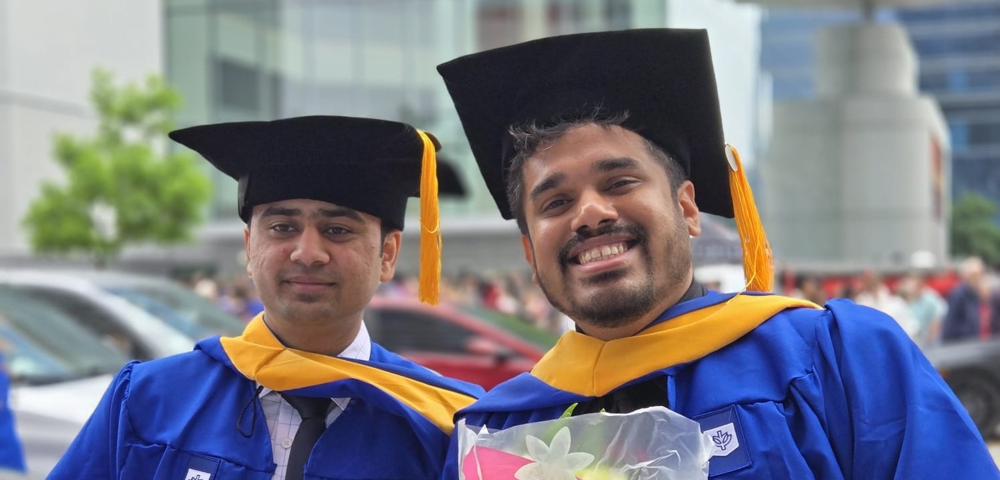
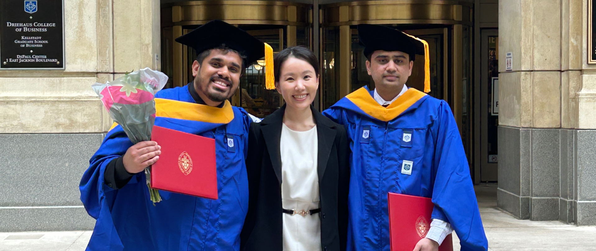

.. Author: Akshay Mestry <xa@mes3.dev>
.. Created on: 24 February, 2025
.. Last updated on: 08 September, 2025

:og:title: Guiding Stars
:og:description: Expressing heartfelt gratitude to the heros who shaped my
    path in life, learning, and beyond...
:og:type: article

.. _miscellany-guiding-stars:

===============================================================================
:octicon:`code-of-conduct` Guiding Stars
===============================================================================

.. author::
    :name: Akshay Mestry
    :email: xa@mes3.dev
    :about: National Louis University
    :avatar: https://avatars.githubusercontent.com/u/90549089?v=4
    :github: https://github.com/xames3
    :linkedin: https://linkedin.com/in/xames3
    :timestamp: 18 August, 2025

.. rst-class:: lead

   Heartfelt gratitude to the stars who illuminated my path

There are always those moments in life when you stop and look back, not merely
at achievements and your mistakes, but at the constellation of individuals
who've shaped you and your path. This article is my tribute to those guiding
stars, those individuals whose wisdom, encouragement, and friendship have been
the bedrock of my growth as a teacher, mentor, and a lifelong learner. Each
person mentioned here has left a significant mark, and it is through their
collective influence that I continue to strive, share, and inspire.

.. admonition:: :octicon:`heart-fill` A note of gratitude
    :class: unusual-one danger

    These reflections aren't exhaustive, nor could they ever be. I've shared
    some stories or incidents in minor detail, yet every individual named here
    has contributed equally to my journey. I'm profoundly grateful for your
    presence, guidance, and support.

.. _my-gaia:

-------------------------------------------------------------------------------
My Gaia
-------------------------------------------------------------------------------

At the very heart of my journey stands my mum, **Sunita**. Like `Gaia`_, the
Earth goddess, my mum has been the unwavering foundation upon which I've built
my ambitions. Her steadfast support during my highs and lows has shaped my
character and instilled in me the values of perseverance, resilience, and
acceptance.

.. figure:: ../assets/media/me-and-mum.jpg
    :alt: Me and Mum celebrating my admission into DePaul University
    :figclass: zoom grayscale

    Mum and I, September 2022, celebrating my admission into DePaul University
    while in Enfield

From comforting me in moments of doubt to celebrating my successes (big and
small), she has always been present, watching me, guiding me, and keeping me
grounded. I recall those evenings at the kitchen table, surrounded by
programming books in my early days of Software Engineering, preparing for
certifications and interviews. She would appear with a restorative cup of
`masala chai`_, reminding me to persist, yet also to rest. These simple acts of
care are cherished far beyond words.

After my father's passing, her love has been the very ground upon which I
stand. Mum, you're my Gaia, and I'm eternally grateful for your strength.

.. _lessons-in-love:

-------------------------------------------------------------------------------
Lessons in love
-------------------------------------------------------------------------------

**Charlotte**, though you're no longer with us, your influence remains woven
into the very fabric of my life. Much like `Uma`_'s transformative love for
`Shankar`_, your presence sparked a profound change in me. You encouraged me
to question deeply and to pursue understanding beyond the surface.

Your patient listening and insightful questions challenged me to think
critically and to share knowledge generously. Your belief in my ability to
teach planted the seed for this very platform. If you were to be here today,
you'd be very proud of me. You always said, "Akshay, you should teach!" These
words echo in my heart each time I stand before a class or mentor someone. In
every student I guide, I see your spirit reminding me of our last chat...

.. epigraph::

    If you loved me like a man, then live your life like a man. Walk this rock
    like a man. Keep moving forward through calm and storm, I'll always be with
    you Akshay, but in a different form.

    -- Charlotte Parks, *14 Apr 2020*

Charlotte, thank you for being my Uma.

.. _zooming-out:

-------------------------------------------------------------------------------
Zooming out
-------------------------------------------------------------------------------

My journey in IT began at `Accenture`_ in 2017, where I had the privilege of
working under **Sajith**'s mentorship. Saj, you were the first person to
recognise potential in me beyond the 9 to 5 routine. I vividly remember our
walks and your advice on "zooming out" and seeing the bigger picture of life
and career. You never offered empty reassurances, but instead provided steady
encouragement to grow and evolve. Your approach was always patient and
insightful, guiding me to question, to seek understanding, and to learn from
every experience.

.. epigraph::

    It is never about doing things perfectly, but about learning and evolving
    along the way.

    -- Saj

Your words have still stayed with me, shaping my approach to both work and
life. Saj, you've been more than a mentor; you've been my guide, my `Mimir`_.

.. _end-credits:

-------------------------------------------------------------------------------
End credits
-------------------------------------------------------------------------------

I'm a big cinephile and I believe life, much like cinema, is never a solo act.
The true magic lies in the collective effort of those who work behind the
scenes. My journey has always been shaped by an extraordinary cast of mentors,
friends, and supporters, each playing a vital role (big and small) in the
stories I share. Everything you see or read here, whether it be projects,
ideas, teachings, etc. is the sum of invaluable contributions from those who've
stood beside me, guiding and encouraging me to step beyond my comfort zone.
This section is my version of the end credits.

A heartfelt tribute to those whose names may not always be in the spotlight,
but whose impact resonates in every lesson I pass on. And as with any good
film, the credits roll long after the story ends. Therefore, this list will
continue to grow, as I'm certain there are more brilliant minds and kind souls
yet to cross my path.

.. note::

    The following list is in alphabetical order soley for clarity. Every person
    holds equal importance and has had a significant influence on my life.

.. _cast-antonio-tovar:

Antonio Tovar
===============================================================================

`Dr. Tovar <https://www.linkedin.com/in/antoniotovar>`_, I first met you at NLU
during the NASA Open Science workshop in 2024, where you were co-leading and
generously offered me the opportunity to intern under your guidance at NASA.
You've always been kind, supportive, a father figure, and a teacher ready with
valuable advice and encouragement.

        final day
    :figclass: zoom grayscale

    Dr. Tovar with my students at NASA Open Science 2025 after presentations

You were the one who helped my dream of becoming a professor come true, and for
that, I'm deeply grateful. Our countless hour-long discussions about teaching
and life have been a source of inspiration, and your stories (rich with wisdom
and experience) are ones I absolutely cherish! You've opened doors for me,
provided opportunities to grow, and have always encouraged me to pursue
excellence.

Thank you for believing in me, Dr. Tovar!

.. _cast-cameron-riddell:

Cameron Riddell
===============================================================================

`Cameron <https://www.linkedin.com/in/cameron-riddell/>`_, you've been a true
light and a source of inspiration in my open science and data visualisation
journey. Although our conversations have been entirely virtual, your mentorship
has bridged timezones. You and your resourceful teachings have offered clarity
and encouragement precisely when I needed it most.

Your skills and insights into visualisation, particularly your introduction to
`Edward Tufte`_'s work, have honestly reshaped my approach to presenting and
interpreting data. Whenever I see a chart or someone asks me for my opinion on
how to visualise it, I always think of you and your teachings; often sharing
your videos and resources with them. You possess a rare ability to make complex
concepts accessible, and your encouragement has helped me grow both as a
learner and as a teacher.

Cheers for being such a "legend", mate!

.. _cast-fatemeh-taghvaei:

Fatemeh Taghvaei
===============================================================================

**Fatemeh**, our paths crossed thanks to :ref:`Dr. Tovar <cast-antonio-tovar>`
while I was still a student at DePaul and you were teaching at NLU. I was
supposed to shadow and learn from you in your Machine Learning class, and that
experience became a turning point in my academic career. To me, you're more
than a fellow professor; you're a mentor, a friend, and perhaps my greatest
well-wisher!

    Fatemeh attending my graduation ceremony alongside Young, June 2025

I still remember my first day of teaching at the uni. I was nervous and
anxious. But you were there, guiding me through the process, attending all my
classes, and reminding me of my duties and responsibilities. And besides
:ref:`Young <cast-young-song>`, you were the only other friend who came to my
graduation and celebrated till the end. Our conversations about teaching, life,
and research have been super duper invaluable for me. Most importantly, you've
always believed and encouraged me to pursue my dream of earning a PhD from
Stanford and for that, I'm very grateful.

I know I give you hard time, Prof. Fatemeh, but I just have one thing to say...
Wowwwwwwwwww!

.. _cast-john-komarnicki:

John Komarnicki
===============================================================================

`John <https://www.linkedin.com/in/john-k-819716148/>`_, you're the force
behind `Chicago Code and Coffee`_, a monthly gathering that has become a
lifeline for students, job seekers, and professionals in Chicago. I first met
you at one of these events during a particularly trying time in my life. I was
searching for a distraction and it turned out to be exactly what I needed. It
wasn't just a meet-up, but an open, supportive community that you and your team
had fostered with care.

.. carousel::
    :show_controls:
    :show_fade:
    :show_indicators:

    .. figure:: ../assets/media/chicago-code-coffee-3.jpg
        :alt: Chicago Code and Coffee Event (December 2024)

        In December 2024, we started having name tags for all the attendees
        of the Chicago Code and Coffee

    .. figure:: ../assets/media/chicago-code-coffee-2.jpg
        :alt: Chicago Code and Coffee Event (January 2025)

        January 2025 Chicago Code and Coffee, surprisingly had a lot of people
        showing up, despite of the cold and windy weather

    .. figure:: ../assets/media/chicago-code-coffee-4.jpg
        :alt: Chicago Code and Coffee Event Welcoming Banner (February 2025)

        Chicago Code and Coffee meet-up welcoming Banner at the Capital One
        cafe, Thanks for Angel and his team for making this happen

    .. figure:: ../assets/media/chicago-code-coffee-1.jpg
        :alt: Chicago Code and Coffee Event (February 2025)

        Chicago Code and Coffee, February 2025 packed a lot of new faces and
        familiar ones, all eager to learn and connect

    .. figure:: ../assets/media/chicago-code-coffee-team.jpg
        :alt: Chicago Code and Coffee Team (June 2025)

        Chicago Code and Coffee team, June 2025. Hyunsu Kim (left), Aarón
        Ramírez Lezama (left centre), Sameer Mathad (right centre), and John
        Komarnicki (right)

    .. figure:: ../assets/media/chicago-code-coffee-5.jpg
        :alt: Chicago Code and Coffee Event (July 2025)

        July 2025 Chicago Code and Coffee started with a smaller audience than
        usual, but it grew as the day progressed with people coming in from
        all over the city

    .. figure:: ../assets/media/chicago-code-coffee-6.jpg
        :alt: Chicago Code and Coffee Event (July 2025)

        Chicago Code and Coffee, July 2025 as the day progressed, more people
        joined in, creating a vibrant atmosphere of learning and sharing
        their experiences

    .. figure:: ../assets/media/chicago-code-coffee-7.jpg
        :alt: Chicago Code and Coffee Event (August 2025)

        August 2025 Chicago Code and Coffee, a lively gathering of some known
        and new professionals and enthusiasts, all eager to connect and learn
        from each other

As time passed, our community has grown significantly. I became a volunteer,
and more people have found comfort and opportunity through your work. On behalf
of everyone who has ever found camaraderie or a new beginning at Chicago Code
and Coffee, I'd like to thank you, John. Your efforts have created a space
where people truly belong.

You, my friend, will get no strikes!

.. seealso::

    Join Chicago Code and Coffee's `Discord`_ and sign up for the upcoming
    event on `Meetup`_.

.. _cast-judy-cazares:

Judy Cazares
===============================================================================

`Judy <https://www.linkedin.com/in/judyc-data>`_, I first met you in 2024 at
`ChiPy`_, and you were among the very first to welcome me into the fold. Our
paths crossed yet again at another meet-up, and from there, a genuine
friendship blossomed. You've always been kind, supportive, and remarkably
generous with your time and wisdom, whether the topic is life, career, or
something more personal.

What I appreciate the most is your willingness to truly listen and offer advice
that is both thoughtful and grounded. I often find myself reflecting on your
words surprisingly more than I've with anyone else. Our playful banter and
jokes are a highlight, yet it is amusing how I always end up taking your advice
(sooner or later) to heart. You've never questioned my decisions nor tried to
steer me forcefully; instead, you've been a gentle mentor, guiding me with
patience and understanding, and that's a reminder that mentorship isn't about
following instruction, but about encouragement and trust.

PS: I got a new humidifier!

.. _cast-madhavi-rege:

Madhavi Rege
===============================================================================

**Madhavi**, you've been an incredible mentor and a profound influence in my
life. Of all the people I've worked under, you were perhaps the most critical
and impactful. Looking back, I realised that it was under your leadership that
I mastered the art of time and work management. Whenever I'm asked how I
manage my responsibilities and personal ventures, my answer is always the same:
it's thanks to someone I had the privilege of working with in the past.

You nurtured my ability to think critically, plan with precision, and execute
tasks with attention. These qualities still remain with me today and into every
project and professional endeavour.

For all your coaching, I'm deeply grateful...

.. _cast-sameer-g-mathad:

Sameer Gururaj Mathad
===============================================================================

`Sameer <https://www.linkedin.com/in/sameer-gururaj-mathad/>`_, our friendship
began during my final quarters at DePaul while sharing classes, assignments,
and academic hurdles. Our friendship has grown into something I truly value. I
often tease you about your disciplined approach, but beneath the banter lies a
genuine admiration for your steady commitment to hard work.

    Sameer and I, June 2025 at our graduation ceremony

What I don't usually say, and perhaps I should more often, is how much I admire
your steady, no-bullshit approach to hard work and study. While I often pride
myself on being a mentor or a bit of a teacher now and then, there have been
moments where I've felt more like a student, learning a lesson or two from you.
And I for sure, look forward to many more meaningful conversations and moments
of learning together.

.. _cast-shailesh-kewat:

Shailesh Kewat
===============================================================================

**Shailesh**, you're a true gentleman and a steadfast pillar of support. I
still remember our friendship began during a challenging phase in our lives,
filled with late nights revising for tests. Though the results didn't always
reflect our efforts, I gained and scored something far more valuable; a
lifelong friend and cherished memories.

You've stood by me through both triumphs and trials, especially after I lost
my :ref:`Charlotte <lessons-in-love>`. You encouraged me to return to teaching
and ensured I had everything I needed to overcome self-doubt. Your wisdom on
public speaking and community engagement gave me the courage to build this
platform and the confidence I carry today.

Here's 🍷 to our friendship!

.. _cast-shilpa-musale:

Shilpa Musale
===============================================================================

`Shilpa <https://www.linkedin.com/in/shilpamusale/>`_, you've been my anchor
and source of wisdom since my first year at the uni. At a time when I felt
isolated and overwhelmed, you made me feel safe and welcomed. Our conversations
and your stories have been more than memories; they've been life lessons, each
filled with quiet wisdom.

You've guided me through career decisions and supported me during difficult
times. Your presence has been reassuring, whether through a phone call, a
message, or a spontaneous invitation for a walk. I'm truly grateful to have
found a mentor in you, and I know our bond will only grow stronger.

.. _cast-young-song:

Young Song
===============================================================================

`Young <https://www.linkedin.com/in/youngsong-us/>`_, our friendship began in
my second quarter at DePaul, where we both took on the challenge of Discrete
Structures. From the outset, your curiosity and support stood out, and I'm
truly grateful for the friendship we've built since then!

    Young attending and celebrating our graduation ceremony, June 2025

One memory that remains vivid is my graduation day. My mum wasn't able to
attend nor anyone else, and it could've been a lonely milestone. Yet you were
there for me and :ref:`Sameer <cast-sameer-g-mathad>`, arriving early (as
usual) and staying through the entire ceremony, from the first moments at seven
in the morning until the celebrations ended late in the afternoon. You brought
us gifts and, more importantly, your unwavering presence. In a moment that
could've felt empty, you filled it with warmth and celebration.

And for that... I'm very thankful, Young!

.. _Gaia: https://en.wikipedia.org/wiki/Gaia
.. _masala chai: https://en.wikipedia.org/wiki/Masala_chai
.. _Uma: https://en.wikipedia.org/wiki/Parvati
.. _Shankar: https://en.wikipedia.org/wiki/Shiva
.. _Accenture: https://www.accenture.com/us-en
.. _Mimir: https://en.wikipedia.org/wiki/Mímir
.. _Edward Tufte: https://www.edwardtufte.com
.. _Chicago Code and Coffee: https://www.meetup.com/code-and-coffee-chicago/
.. _Discord: https://discord.gg/NNYtWNFByN
.. _ChiPy: https://www.chipy.org/
.. _Meetup: https://www.meetup.com/code-and-coffee-chicago/
